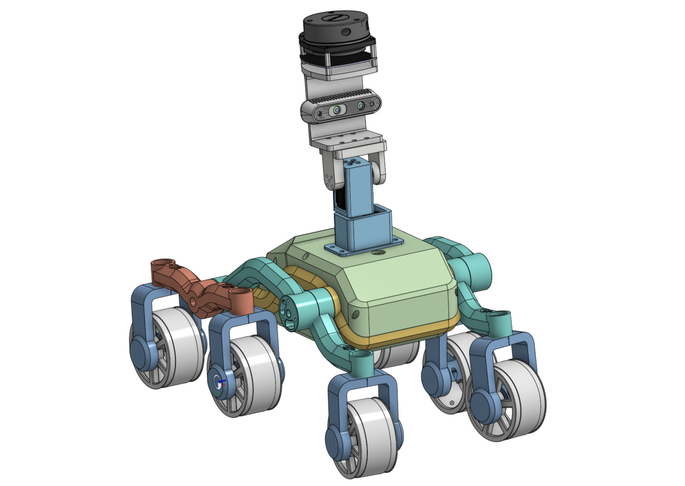
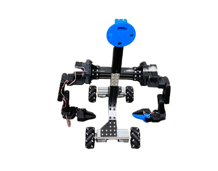

  <header class="animate-section" style="text-align: center; margin-bottom: 120px;">
    <h1 style="font-size: 5rem; font-weight: 800; color: #0f172a; margin-bottom: 20px; letter-spacing: -0.05em;">
      Sanatan — Projects
    </h1>
    
Engineering Portfolio

  </header>

  <!-- Project 1: srobotv1 -->
  

    <section class="project-card">
      <h2 style="text-align: center; margin-bottom: 50px;">srobotv1</h2>
      

        
      

      

        The <b>srobotv1</b> is an advanced 7-axis robotic manipulator engineered for maximum stability and dexterity. By integrating <b>bearings throughout the entire assembly</b>, I eliminated the 1-degree base deflection that typically results in massive precision errors at the gripper.
        

          <a href="https://sanrobo206.github.io/srobotv1/" class="cta-button">EXPLORE TECHNICAL ANALYSIS</a>
        

      

    </section>
  

  <!-- Project 2: Mobile Fire Detection -->
  

    <section class="project-card">
      <h2 style="text-align: center; margin-bottom: 50px;">Fire Detection Rover</h2>
      

        
      

      

        An autonomous safety solution designed for rapid response in high-risk environments. This project integrates <b>multi-sensor data fusion</b> to identify heat signatures and smoke patterns in real-time, providing a mobile shield against industrial hazards.
        

          <a href="https://sanrobo206.github.io/mfds/" class="cta-button">EXPLORE TECHNICAL ANALYSIS</a>
        

      

    </section>
  

  <!-- Project 3: sHUMANOID v.1 -->
  

    <section class="project-card">
      <h2 style="text-align: center; margin-bottom: 50px;">sHUMANOID v.1</h2>
      

        
      

      

        A mobile humanoid platform engineered for complex manipulation. Built with a robust <b>extruded aluminum</b> frame, the robot features a <b>mecanum wheel base</b> for omnidirectional movement, blending industrial strength with fluid agility.
        

          <a href="https://sanrobo206.github.io/shumanoidv1" class="cta-button">DIVE DEEPER</a>
        

      

    </section>
  

  <!-- Project 4: sGRIPPER v.1 -->
  

    <section class="project-card">
      <h2 style="text-align: center; margin-bottom: 50px;">sGRIPPER v.1</h2>
      

        
      

      

        A high-precision end-effector featuring an industrial <b>MGN 7 linear rail</b> and a custom <b>cam-based actuation</b> mechanism. This architecture provides perfect parallel finger movement and high mechanical advantage.
        

          <a href="https://sanrobo206.github.io/sgripperv1" class="cta-button">EXPLORE MORE INSIDE THE PROJECT</a>
        

      

    </section>
  

  <footer class="animate-section" style="margin-top: 100px; text-align: center; color: #94a3b8; font-size: 0.9rem; padding-bottom: 80px; letter-spacing: 2px;">
    &copy; 2026 DESIGNED BY SANATAN SINHA
  </footer>

