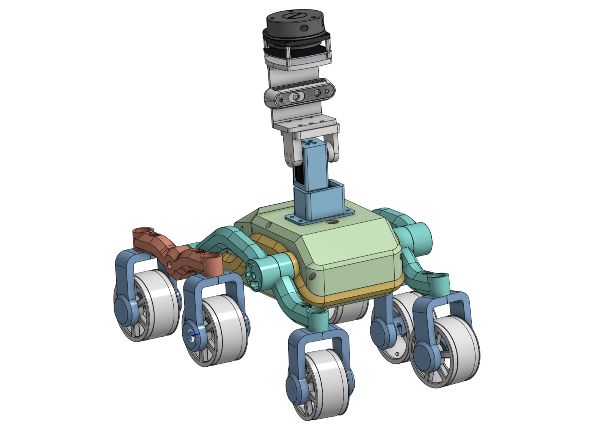
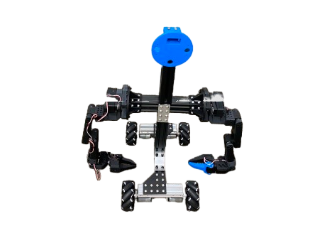
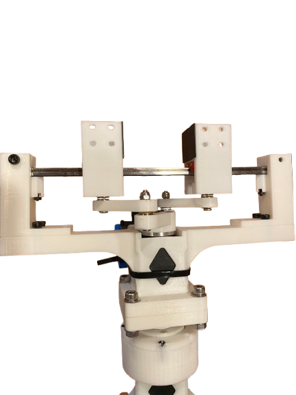

<nav class="site-nav" aria-label="Primary navigation">
  

    <a class="brand" href="{{ '/' | relative_url }}">SanRobot</a>
    

      <a href="#projects">Projects</a>
      <a href="#about">About</a>
    

  

</nav>

  <header class="site-hero animate-section">
    
Advanced Robotic Systems

    <h1>SanRobot</h1>
  </header>

  <!-- Project 1: SanSCARA -->
  

    <section class="project-card">
      <h2 style="text-align: center; margin-bottom: 50px;">SanSCARA</h2>
      

        
      

      

        SanSCARA is a unique hybrid, industrial-quality <b>7-axis SCARA robot</b>. Its aluminum components are CNC machined for rigidity and precision. It delivers <b>0.05 mm repeatability</b> and extends the traditional SCARA architecture with a roll-yaw-pitch wrist at the end, enabling flexible tool orientation across a broad working envelope.
      

    </section>
  

  <!-- Project 2: SR2i -->
  

    <section class="project-card">
      <h2 style="text-align: center; margin-bottom: 50px;">SR2i</h2>
      

        
      

      

        SR2i is a lightweight, industrial <b>7-axis robotic arm</b> constructed from carbon fiber and aluminum. Precision ball bearings support smooth, rigid joint motion, while its high-performance mechanical design achieves <b>0.1 mm repeatability</b> for accurate and versatile manipulation.
      

    </section>
  

  <!-- Project 3: sGripper Ultra-Lightweight -->
  

    <section class="project-card">
      <h2 style="text-align: center; margin-bottom: 50px;">sGripper Ultra-Lightweight</h2>
      

        
      

      

        An ultra-lightweight <b>rack-and-pinion gripper</b> that uses carbon-fiber guides and a lightweight carriage. A miniature ball bearing keeps each rack firmly engaged with the pinion, preventing it from twisting or lifting away during operation. At just <b>150 grams including the motor</b>, it is significantly lighter than other grippers of comparable quality while retaining a precise, rigid mechanism.
      

    </section>
  

  <!-- Project 4: sROBOT v.1 -->
  

    <section class="project-card">
      <h2 style="text-align: center; margin-bottom: 50px;">sROBOT v.1</h2>
      

        
      

      

        The <b>srobotv1</b> is an advanced 7-axis robotic manipulator engineered for maximum stability and dexterity. By integrating <b>bearings throughout the entire assembly</b>, I eliminated the 1-degree base deflection that typically results in massive precision errors at the gripper.
        

          <a href="https://sanrobo206.github.io/srobotv1/" class="cta-button">EXPLORE TECHNICAL ANALYSIS</a>
        

      

    </section>
  

  <!-- Project 5: Mobile Fire Detection -->
  

    <section class="project-card">
      <h2 style="text-align: center; margin-bottom: 50px;">Fire Detection Rover</h2>
      

        
      

      

        An autonomous safety solution designed for rapid response in high-risk environments. This project integrates <b>multi-sensor data fusion</b> to identify heat signatures and smoke patterns in real-time, providing a mobile shield against industrial hazards.
        

          <a href="https://sanrobo206.github.io/mfds/" class="cta-button">EXPLORE TECHNICAL ANALYSIS</a>
        

      

    </section>
  

  <!-- Project 6: sHUMANOID v.1 -->
  

    <section class="project-card">
      <h2 style="text-align: center; margin-bottom: 50px;">sHUMANOID v.1</h2>
      

        
      

      

        A mobile humanoid platform engineered for complex manipulation. Built with a robust <b>extruded aluminum</b> frame, the robot features a <b>mecanum wheel base</b> for omnidirectional movement, blending industrial strength with fluid agility.
        

          <a href="https://sanrobo206.github.io/shumanoidv1" class="cta-button">DIVE DEEPER</a>
        

      

    </section>
  

  <!-- Project 7: sGRIPPER v.1 -->
  

    <section class="project-card">
      <h2 style="text-align: center; margin-bottom: 50px;">sGRIPPER v.1</h2>
      

        
      

      

        A high-precision end-effector featuring an industrial <b>MGN 7 linear rail</b> and a custom <b>cam-based actuation</b> mechanism. This architecture provides perfect parallel finger movement and high mechanical advantage.
        

          <a href="https://sanrobo206.github.io/sgripperv1" class="cta-button">EXPLORE MORE INSIDE THE PROJECT</a>
        

      

    </section>
  

  <section id="about" class="about-section animate-section">
    <h2>About Sanatan Sinha</h2>
    
Sanatan Sinha is the engineer and creator behind SanRobot. His work focuses on developing precise, lightweight robotic systems through practical mechanical design, advanced materials, and iterative prototyping.

  </section>

  <footer class="site-footer animate-section">
    &copy; 2026 Designed by Sanatan Sinha
  </footer>

